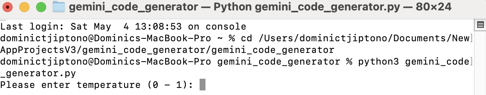

# gemini_code_generator

**Gemini Code Generator** is an application used to generate code of any programming language based on the given
specifications, with Google Gemini AI integrated into it.

# Source Code

The source code of **Gemini Code Generator** is available in 
[Source Code](https://github.com/SoftwareApkDev/gemini_code_generator/blob/master/gemini_code_generator/gemini_code_generator.py).

# Installation

```
pip install gemini_code_generator
```

# How to Use the Application?

Pre-requisites:

1. [Python](https://www.python.org/downloads/) installed in your device.
2. .env file in the same directory as <GEMINI_CODE_GENERATOR_DIRECTORY> and has the value of GEMINI_API_KEY.

```
cd <GEMINI_CODE_GENERATOR_DIRECTORY>
python3 gemini_code_generator.py
```

**Note:** Replace <GEMINI_CODE_GENERATOR_DIRECTORY> with the path to the directory of the application 
**Gemini Code Generator**.

Then, the application will start with something looking like in the screenshot below.



You will then be asked to input the following values.

1. Temperature - between 0 and 1 inclusive
2. Top P - between 0 and 1 inclusive
3. Top K - at least 1
4. Max output tokens - at least 1

The following screenshot shows what is displayed after inputting the mentioned values.


You will be required to enter the name of the programming language you want the code to be generated in. Then, you
will be asked to enter the name of the file containing the generated code (it must be a file of the name of the 
programming language you entered earlier).


After that, your next step is to enter the specifications of the code you want to generate.


Then, the file with the generated code will be run and you will see the output.


The generated code is in the relative path "../codes/<CODE_FILE_NAME>" from <GEMINI_CODE_GENERATOR_DIRECTORY>, 
where <CODE_FILE_NAME> is the name of the file containing the code (as you entered previously).


